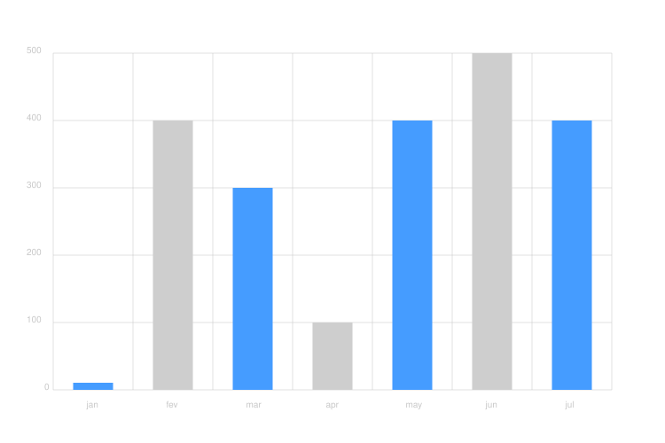

# BarChart


Um projeto C# simples que gera gráficos de barras em formato **SVG**. Ideal para gerar visualizações estáticas diretamente a partir de dados em código.


Exemplo de código svg gerado:



A partir do seguinte código utilizando o BarChart

```csharp
class Start {

    public static void Main()
    {

        double[] y_data = { 10, 400, 300, 100, 400, 500, 400 };
        string[] labels = { "jan", "fev", "mar", "apr", "may", "jun", "jul" };

        new BarChart(y_data, labels, 500, 750).Launch(@"path/to/file.svg", 100);
    }
} 
```
# Para Usar
``` bash

git clone https://github.com/Yuri-Kranholdt/BarChart.git
cd BarChart
```
